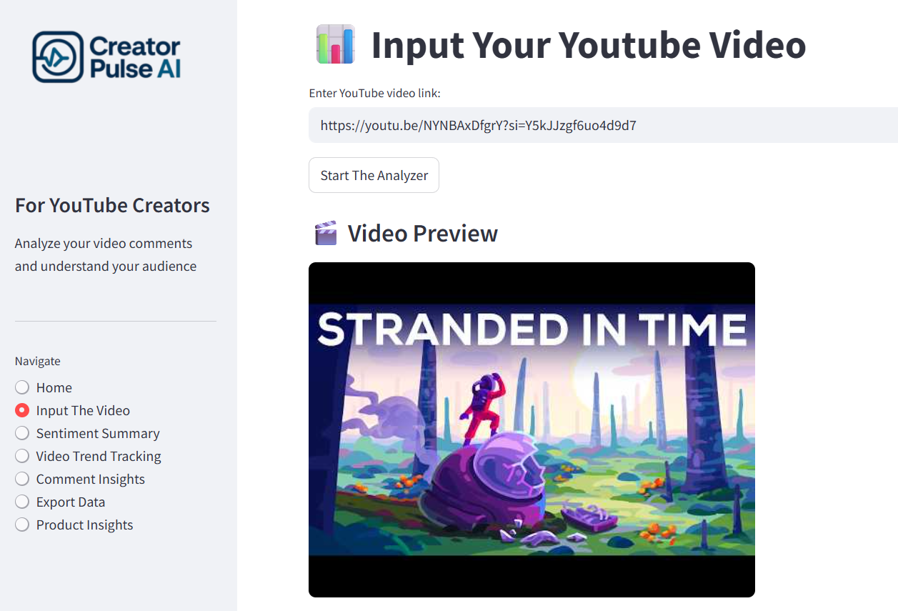
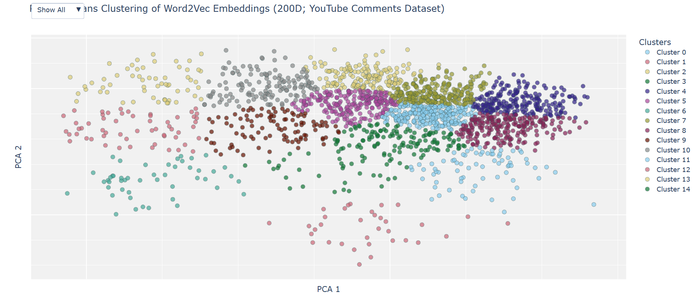

# 🎥 CreatorPulse AI — Decode Your YouTube Audience

**For YouTube Creators**  
Analyze your video comments and understand your audience in seconds.

---

## 🤖 What is CreatorPulse AI?

**CreatorPulse AI** is an intelligent sentiment analysis and feedback interpretation platform built specifically for **YouTube content creators**. It transforms thousands of viewer comments into **actionable insights** using advanced Natural Language Processing (NLP) techniques.

---

## 🔗 Demo Links

- 📹 YouTube Demo: [Watch here (Soon)](*********************)
- 🧠 Word2Vec Skip-Gram Model: [Hosted on Hugging space](https://huggingface.co/spaces/nitish-11/skipgram-word2vec-model-with-youtube-comments)

---

## 🖼️ Screenshots

**🎬 Input Video Page — Dashboard UI**

**🧠 Skip-gram Word2Vec (200-D) — Model Structure**

---

## 🛠️ How It Works

- 🔍 **Fetch** up to **6,000 comments** per video using the YouTube API.
- 🤖 **Predict sentiment** using a **custom-trained BERT model**.
- 🧠 **Extract themes and summaries** via **LangChain + Gemini 1.5**.
- 📊 **Visualize** results in an **interactive Streamlit dashboard**.
- 🧾 **(Coming Soon)** One-click **PDF export** for team sharing.

---

## 🧪 Technical Highlights

- 🧠 **Custom BERT Model** trained on **1M+ labeled YouTube comments**, achieving **86.52% accuracy**.
- 🪄 **LangChain + Gemini 1.5** used to detect themes (e.g., *“30% negative due to thumbnail”*).
- ⚡ **< 2s latency** with threaded scraping, model quantization, and smart caching.
- 🧮 Word2Vec (skip-gram, 200d) + ML models (XGBoost, RF, LGBM, LR) tested before BERT.
- 🪶 **Open-source** sentiment model hosted on Hugging Face.

---
## 🎯 Why It Matters

- 🚀 Understand audience reactions in real time.
- 📉 Cut feedback processing time by over 70%.
- 📈 Identify viewer sentiment trends for better content strategy.
- 🧩 No technical skills needed to interpret NLP results.

---

## 📦 Key Features

- 🔗 **YouTube Link Analysis** – Paste a link and go.
- 💬 **Sentiment Breakdown** – Viewer emotion insights.
- 📈 **Time-based Trends** – Weekly sentiment visualization.
- 🧠 **Comment Summarization** – Auto-generated summaries.
- 📥 **PDF Report Export** – Share your insights. *(Coming Soon)*

---

## 🧩 Product Architecture

### ⚙️ System Design Overview

- **Frontend**: Streamlit with Plotly, WordCloud.
- **Backend**: PyTorch for BERT, LangChain-Gemini for summarization.
- **Data Flow**: YouTube API ➜ Sentiment Engine ➜ LLM Summary ➜ Caching ➜ Dashboard.
- **Performance**: Threading + Quantization + Async Caching.

---

### 📌 Core Components

| Component | Description |
|----------|-------------|
| `get_comments(video_id)` | Fetches up to 6,000 comments with threading |
| `predict_sentiment()` | Runs inference via fine-tuned BERT |
| `analyze_comments()` | Uses LangChain + Gemini for summarizing |
| `run_background_analysis()` | Async job that stores summaries in cache |

---

### 🧠 Research Path & Dataset

#### Dataset:
- 📊 **1,032,225 YouTube comments**, labeled by sentiment.  
- 🔗 [Dataset Source on Hugging Face](https://huggingface.co/datasets/AmaanP314/youtube-comment-sentiment)

#### Training Workflow:
1. **Initial ML Phase**:
   - Tokenization & TF-IDF, followed by Word2Vec (200D, skip-gram).
   - Trained and evaluated: XGBoost, LightGBM, RF, Logistic Regression.
   - Best performance: **~70% accuracy** with hyperparameter tuning.

2. **BERT Fine-Tuning**:
   - Cleaned comments.
   - Trained BERT over multiple epochs.
   - Achieved **86.53% accuracy** on test data.

---

## 👥 Ideal Users

- 🎬 **Content Creators**
- 📊 **Data Analysts & Agencies**
- 📣 **Marketing Teams**
- 🧪 **Recruiters or Researchers** assessing viewer engagement

---

## 📬 Coming Soon

- 🧾 PDF Export Feature  
- 🎯 Improving the Model on Multi-language comments analysis
- 🧠 Reduce the Latency even more
---

**Made with ❤️ for creators who care.**  
*Let your comments talk. CreatorPulse AI listens.*

