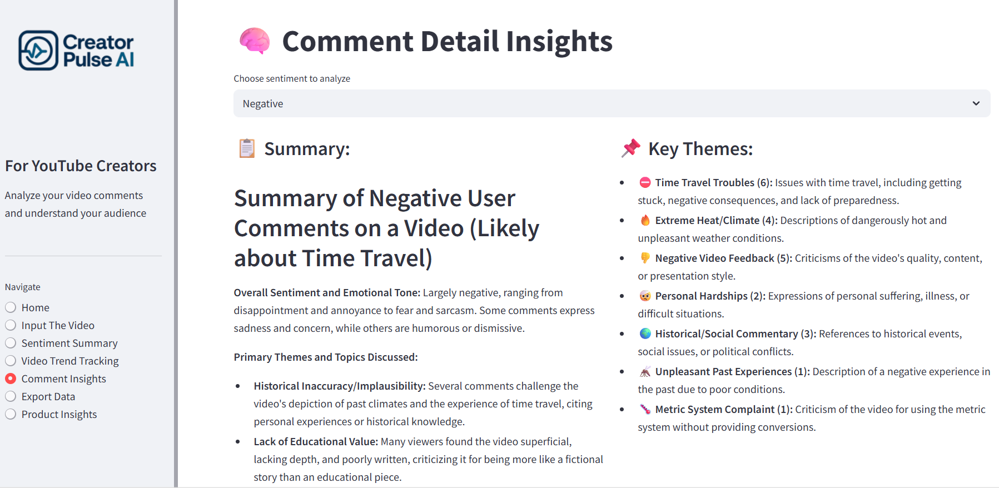
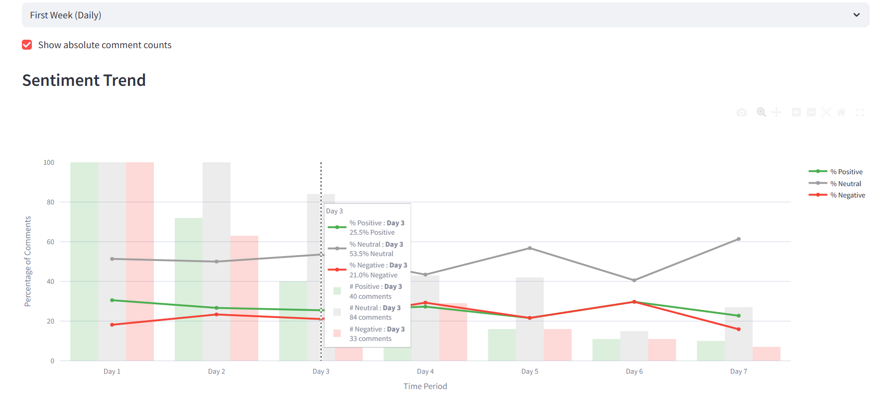

# 🎥 CreatorPulse AI — Decode Your YouTube Audience

**For YouTube Creators**  
Analyze your video comments and understand your audience in seconds.

---

## 🤖 What is CreatorPulse AI?

**CreatorPulse AI** is an intelligent sentiment analysis and feedback interpretation platform built specifically for **YouTube content creators**. It transforms thousands of viewer comments into **actionable insights** using advanced Natural Language Processing (NLP) techniques.

---

## 🔗 Demo & Model Links

- 📹 YouTube Demo: [Watch here (Coming Soon)](*********************)
- 🧠 Word2Vec Skip-Gram Model: [View on Hugging Face](https://huggingface.co/spaces/nitish-11/skipgram-word2vec-model-with-youtube-comments)
- ☁️ AWS Deployed Version: [Coming Soon](*****************)
- 🧠 Fine-tuned BERT Model: [View on Hugging Face](https://huggingface.co/nitish-11/youtube_sentiment_analysis_bert)

---

## 🖼️ Screenshots

**🎬 Video Input & Dashboard Overview**  
*Streamlined interface for YouTube video analysis.*  

**🧠 Word2Vec Skip-Gram (200-D) Visualization**  
*Token embedding structure used in early-stage model experimentation.*  

**💬 Comment Insights via LangChain + Gemini**  
*Automated theme extraction and comment summarization.*  

**📈 Sentiment Trends Over Time**  
*Track audience sentiment on a daily and weekly basis.*  

**📊 Overall Viewer Sentiment in Response to Your Video**  
*High-level breakdown of viewer reactions.*  

---

## 🛠️ How It Works

- 🔍 **Fetch** up to **6,000 comments** per video using the YouTube API.
- 🤖 **Predict sentiment** using a **custom-trained BERT model**.
- 🧠 **Extract themes and summaries** via **LangChain + Gemini 1.5**.
- 📊 **Visualize** results in an **interactive Streamlit dashboard**.
- 🧾 **(Coming Soon)** One-click **PDF export** for team sharing.

---

## 🧪 Technical Highlights

- 🧠 **Custom BERT Model** trained on **1M+ labeled YouTube comments**, achieving **86.53% accuracy**.
- 🪄 **LangChain + Gemini 1.5** used to detect themes (e.g., _“30% negative due to thumbnail”_).
- ⚡ Achieved **< 2s latency** with threaded scraping, quantized inference, and smart caching.
- 🧮 Explored traditional NLP with Word2Vec (skip-gram, 200D) + ML models (XGBoost, RF, LightGBM, Logistic Regression).
- 🪶 Open-sourced the fine-tuned BERT model on Hugging Face.

---

## 🎯 Why It Matters

- 🚀 Understand audience reactions in real time.
- 📉 Cut feedback processing time by over 70%.
- 📈 Identify viewer sentiment trends to refine your content strategy.
- 🧩 Zero technical skills needed — insights made creator-friendly.

---

## 📦 Key Features

- 🔗 **YouTube Link Analysis** – Just paste a video link and start.
- 💬 **Sentiment Breakdown** – Emotion-level insights from comments.
- 📈 **Time-based Trends** – Track sentiment daily and weekly.
- 🧠 **Comment Summarization** – Auto-generated summaries.
- 📥 **PDF Report Export** – Clean, shareable insight reports. *(Coming Soon)*

---

## 🧩 Product Architecture

### ⚙️ System Design Overview

- **Frontend**: Streamlit + Plotly + WordCloud visualizations.
- **Backend**: PyTorch (for BERT), LangChain + Gemini (for summarization).
- **Data Flow**:  
  `YouTube API ➜ Sentiment Engine ➜ LLM Summary ➜ Caching ➜ Dashboard`
- **Performance Optimizations**:  
  Multi-threading, model quantization, and async caching for real-time use.

---

### 📌 Core Components

| Component | Description |
|----------|-------------|
| `get_comments(video_id)` | Fetches up to 6,000 comments using threading |
| `predict_sentiment()` | Inference using fine-tuned BERT |
| `analyze_comments()` | Uses LangChain + Gemini for summaries |
| `run_background_analysis()` | Async job that stores theme summaries in cache |

---

## 🧠 Research Path & Dataset

### 📊 Dataset Used:
- **1,032,225 labeled YouTube comments**  
- [Dataset Source (Hugging Face)](https://huggingface.co/datasets/AmaanP314/youtube-comment-sentiment)

---

### 🔬 Training Workflow:

#### Phase 1 — Classical NLP + ML:
- Preprocessing: tokenization, TF-IDF, and Word2Vec (skip-gram, 200D).
- Models Tried: XGBoost, LightGBM, Random Forest, Logistic Regression.
- Best Accuracy: ~70% after hyperparameter tuning.

#### Phase 2 — Fine-Tuning BERT:
- Cleaned and preprocessed comments.
- Trained custom BERT over multiple epochs.
- Achieved **86.53% accuracy** on test data.

---

## 👥 Ideal Users

- 🎬 **YouTube Content Creators**
- 📊 **Data Analysts & Media Agencies**
- 📣 **Marketing Teams**
- 🧪 **Recruiters or Researchers** studying viewer engagement

---

## 📬 Coming Soon

- 🧾 PDF Export Integration  
- 🌐 Multi-language Sentiment Support  
- 🚀 Further Latency Reduction

---

**Made with ❤️ for creators who care.**  
*Let your comments talk. CreatorPulse AI listens.*
